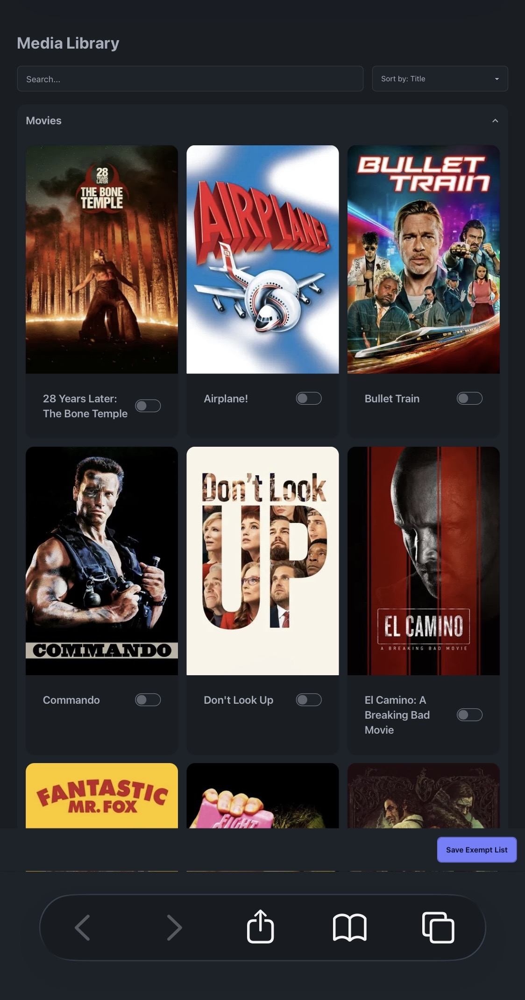
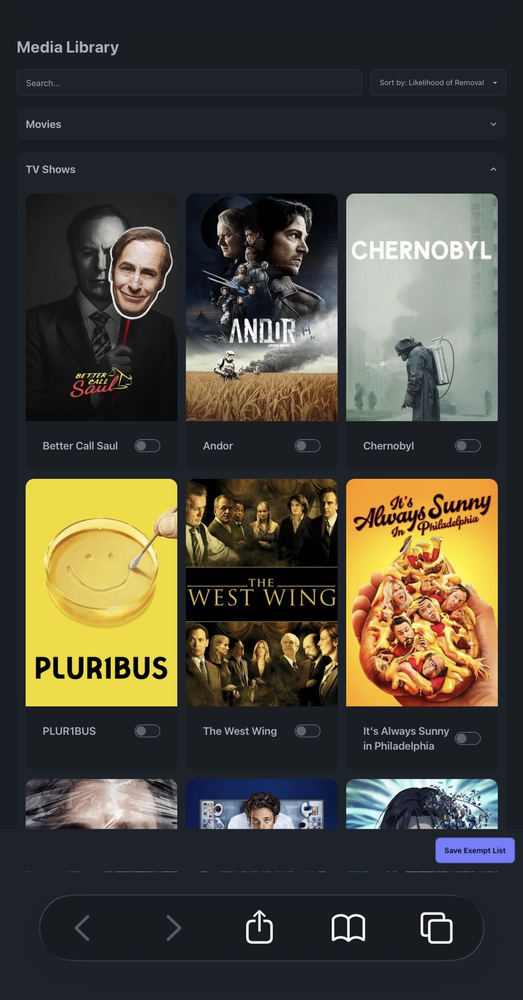
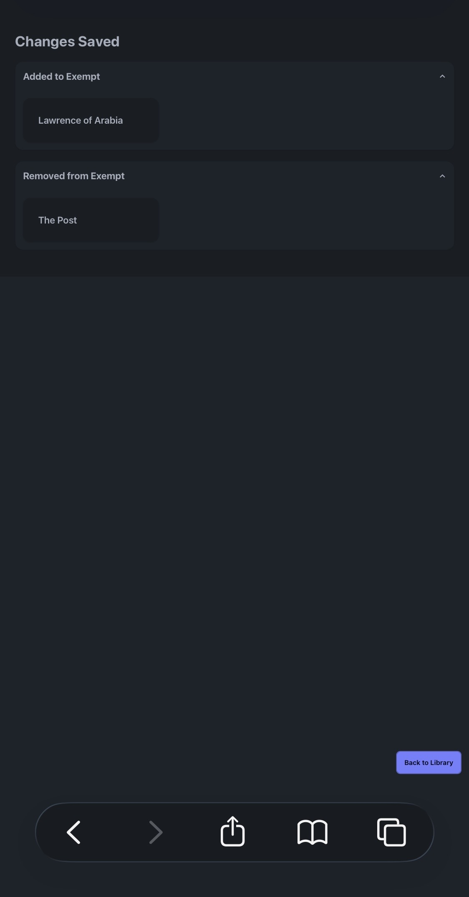

# Clearerr v2

A self-hosted automation tool for managing storage on a Plexarr stack. Built out of my personal annoyance with existing options that don't account for actual disk usage or user preferences when deciding what to remove.

## The Problem

A media server with only 50% storage used is wasting expensive disk space, while the same server running at 95% requires a full time babysitter to manually and frequently cleanup. Existing tools like Maintainerr don't solve this issue as the removal logic is not ideal and data collection limited by the plex api.

## How it Works

### APIs

The plex api does not provide watch statistics for any users besides the owner, even if they are in the same plex home account, and has wildly inacctuate storage estemates.

Clearerr builds library models by hitting internal APIs for Plex, Jellyfin, and Tautulli. It validates the library models are equivalent (all media accounted for and pointing to the same locations) and puts out targeted updates to Plex and Jellyfin when there are discrepancies until all the apps are synced. Accurate watch data is derived as the most recent value between the three providers.

The seererr api is used to safely remove and unmonitor selected items. Afterwards targeted update requests are put to Plex and Jellyfin and the entire library is validated again.

### Storage and Rules

Clearerr walks the actual library directories to see the real space used by the media and compares it to the free space on the share to determine if and how much removal is required.

It uses a weighted rules engine (defined in settings/rules.yaml) to pick what gets deleted. These rule settings are normalized and weighted such that any media attribute can be added to the yaml file and used as a deciding factor. My current rules include:

- Time since added
- Watch history stats
- Current disk utilization
- User set exemptions and requests

### User Interface

A previous iteration relied on users making specially named Jellyfin playlists to mark media as exempt as Plex will not provide other users collection or playlist data. This method was functional but clunky and required multiple accounts for each user.

In this iteration the media exemptions are set by a custom built and hosted web interface. The data and images are set by the backend script via an internal SQLite database, while the frontend app updates the exemptions on a similar table. Users can log in and mark or unmark media as exempt or schedule for removal. Media scheduled for removal is put at the top of the queue for automated deletions and will be deleted regardless if left queued for a specified amount of time.

 Note this container has no front end security at the moment, in production that is being handled by cloudflare tunnel authentication which supports google oauth.

\*The images are from an old version before the ability to schedule removals was added

    
    
    

### Usage

The container was built on unraid and can be added and setup using the template, my-Clearerr.xml. It currently only works if your media library has separate sub-directories for movies and tv shows, as is recommended by most arr guides anyway. You can set the names of these sub-directories in the template as well. The paths provided to Jellyfin and Plex must match exactly in order for validation to pass, again this is already recommended by most guides, i.e.

Plex: path : /data/media → /mnt/user/data/media/
Jelly: path : /data/media/tv/ → /mnt/user/data/media/tv/
Jelly: path : /data/media/movies/ → /mnt/user/data/media/movies/

You can get a TMDB token for free on their website but this will ultimately be an optional backup for fetching image urls if Tautulli becomes unresponsive.

## Future Features

- [ ] Support for saving and removing seasons - this is waiting on me to migrate off my segmented macvlan network as it can only really be via sonarr which I have on a different vlan
- [x] Improve UI: add "requested by" field
- [ ] Improve UI: storage metrics and "recently deleted" - most likely be a new page in the UI
- [ ] Add periodic health checks, especially for less used api connections like Seererr
- [ ] Migrate to Tautulli for image api instead of direct to tmdb. We can keep tmdb as a backup - less WAN calls and fewer accounts needed
- [ ] to_namespace to a shared util clean up the Actions class (no duplicate to_namespace)
- [ ] Replace sys.exit in process_storage_needs with a return so the function is reusable and testable

## Bugs

- [ ] Jellyfin targeted updates post removal are erroring but functional
- [ ] Sonarr removal requests also somtimes reutrn error codes but are functional
- [x] Possible that tautuli watch data updates are not working for shows or seasons. Logs and comments in that area imply that I left something obvious temporarily that I've since forgotten
- [ ] remove broad except: clauses in clearerr.py and library_obj.py
- [ ] SQLite race condition: backend drops and recreates the media table while the frontend serves queries against it
